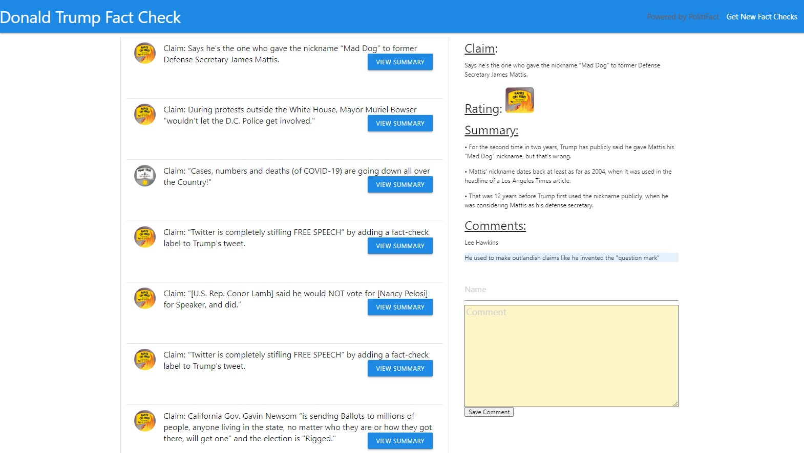

# Fact-Checker 

### Overview

The Fact-Checker scrapes recent fact checks made by PolitiFact on their site using axios and cheerio.  It then uses Mongoose to create documents in a mongo database.  The webpage is then populated with the claim, the rating of the claim and a button to view the summary using Handlebars.  

### Application Use

The database should already be populated with fact checks when a user visits the site ordered from the most recent to the oldest.  The user can then click on the "View Summary" button and the right side of the page is then populated with the claim, the rating, a summary is scraped from the link that was saved in the database from the original scrape, previous comments on the fact check and a section for the user to add a comment with their name.  

If the user would like to check for any new fact checks they can press the "Get New Fact Checks".  This will scrape PolitiFact again but will only add on new fact checks if there it's title doesn't match the title of the most recent fact check in the data base.  If there is a new fact check it will be added to the top.  